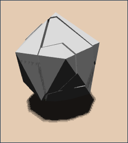
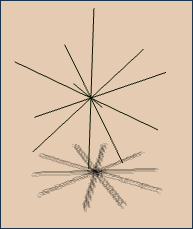
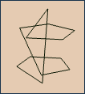

CIS565: Final Project -- GPU-Accelerated Dynamic Real-Time Fracture in the Browser
===========
Fall 2014
-----------
Jiatong He, Kai Ninomiya
-----------
https://www.graphics.rwth-aachen.de/media/teaching_files/mueller_siggraph12.pdf

Algorithm Overview
-----------------
###Fracturing
At a high level, fracturing is implemented by performing boolean intersection
between segments of a fracture pattern and the segments of the object to be
fractured. More information on the method is found in Mueller's paper (above).

A pre-generated test fracture pattern (series of solid meshes):



##Checklist
####Part 1
* Set up codebase (Turbulenz?)
* Get a working rigid body simulator
* Integrate simple webCL (eg. shift mesh's colors)
* Generate some 3D Voronoi decomposition
* Find and highlight intersections with simple mesh (eg glass panel)

##TODO
* ~~Parallel implementation of plane-triangle clipping.~~
* webCL implementation of stream compaction (used in intersection).
* webCL implementation of makeFaces() (needs webCL scan).
* correct orientation/center of fracture pieces.
* center the fracture pattern on point of impact.
* sew fractured pieces back together based on proximity to point of impact.
* correctly handle concave surfaces.

##Progress
###Part 1
####Setting up the codebase
We initially began with Turbulenz, since it seemed like the most powerful engine available and combined the rigid body physics we needed with a renderer.  However, it was difficult to work with the convex hulls we wanted, so we switched to CubicVR.js, an open-source 3d engine that uses ammo.js for physics.

Based on our experience so far, we will probably switch to using mesh
representations instead of specialized convex hull representations, due to the
more useful properties of meshes. Given this switch, it's possible we'll also
move back to Turbulenz or another engine.

####Working Rigid Body Simulator
This was very easy to set up with CubicVR/Ammo (using one of the CubicVR
provided examples), and was completed quickly.

####WebCL
Currently not implemented due to our focus on getting a working engine and demo

####3D Voronoi Decomposition as fracture pattern
This one turned out to be a little tricky because we didn't find a javascript implementation of 3d voronoi decomposition.  We plan on making a library for it later, but for testing, we are using a voronoi decomposition made from Blender.  Blender has the ability to generate a voronoi decomposition from a set of points, which is good enough for us to use as a constant, pregenerated fracture pattern.  This is saved to a .dae file and read in as a set of meshes (cells).

####Intersection Testing
Intersection testing was difficult to solve because we were somewhat limited by the structures available to us through the CubicVR engine.  We spent some time figuring out the method to handle the cell-mesh intersections, which was more difficult than expected due to some limits in the libraries we used.

The most significant one is that Bullet's btConvexHullComputer, which computes a convex hull mesh based on a set of points, seems to be unavailable in ammo.js.
This means that we would need to calculate our own convex hull mesh, or work entirely in convex hulls, which would result in some necessary approximations for the geometry.

Due to these limitations with the convex hull data exposed by Ammo.js, our next
approach will be to do our operations directly on the meshes. In order to move
forward, we plan to perform the fracture computations directly on mesh data
(either an existing CubicVR structure or another simple implementation).

##Debug images

The set of points on the the original object
(which is all that the btConvexHullShape stores):



The set of edges returned by the Bullet btConvexHullShape object
(also not so useful!):



##Paralelization of the Intersection Algorithm
###Initial Thoughts
The intersection algorithm is the first point of paralelization. Each fracture cell can be processed onto the mesh independently, which means that we can first paralelize by cell.  Within each cell, each plane of the cell needs to be used as a clipping plane to then clip against the mesh. This will likely be a bottleneck for the code, since clipping planes will need to be run sequentially.

Note that the current algorithm assumes a triangulated mesh.

The intersection algorithm outline looks to be as follows:

```
setupClipMesh();

For each fracture cell:
  For each face of the fracture cell:
    // perform clipping plane algorithm.  Based on the algorithm described at
    //  http://www.geometrictools.com/Documentation/ClipMesh.pdf
    clipVertices(); // mark vertices as culled or passed.
    clipEdges();  // mark edges as culled, intersecting, or passed.
    clipFaces();  // mark faces as culled or passed, update faces based on edges.  Create new faces/edges if necessary to maintain triangulation.
  end for
end for

rebuildMeshes();  // Parse through the vertex and face arrays and keep the unclipped ones, updating indices.
```

clipFaces() is a little more work than the others.  The core of the algorithm is:
* Update the faces whose edges are partially clipped.
* Generate new edges along the plane
* Generate faces to cover those new edges.  This face will be coplanar to the clipping plane.

There are four cases that can occur for faces:
* 1. all edges are above the clipping plane (no change).
* 2. all edges are below the clipping plane (face gets removed).
* 3. one edge is above, two intersect the clipping plane (this intersection forms a quad so we need to create two new edges and one new face).
* 4. one edge is below, two intersect the clipping plane (this intersection forms a triangle so we only need to add in one new edge).

Some issues are immediately clear:
* Different amounts of processing will be required for different cells/planes.  This varies depending primarily on the number of faces in a cell.
* Different amounts of memory will be needed for different cells/planes.  It is not immediately clear how many new vertices and faces a clipping plane will create.  Do we need to overcompensate and assume the worst-case scenario every time?  This will likely become the main concern.
* We need to adapt the presented algorithm to be able to handle multiple sequential clipping planes.  This should be straightforward since new vertices, edges, and faces are added into the list.
* What happens when the fracture pattern does not completely cover the mesh?  do we scale it up so that it encloses the bounding box?  Do we need to handle outside pieces in a special way?

Some optimizations can be made:
* The fracture pattern can be stored as a non-triangulated mesh.  That is, each face is in its own plane.  This way there is no need to calculate the minimum number of clipping planes necessary.
* What if we optimized by vertex-face-edge : plane intersection as opposed to cell-by-cell?

Keeping these issues in mind, we came up with a new way to parallelize the intersection algorithm:
###Chosen Algorithm
The goal of this algorithm was to find a method to clip meshes that had the least amount of dependence between units.  With this in mind, we came up with the following:

Our code now parallelizes on a per-clipping-face-per-mesh-triangle level.  We run one clipping plane per cell on each triangle in the mesh per loop iteration, iterating through the list of clipping planes per cell.

One key feature is that we no longer handle the mesh as a whole (we still keep track), but as a set of unrelated triangles.  We take this triangle "soup" and run it through the algorithm, getting new triangles with each iteration.  These triangles can be connected by merging identical points at the end of the algorithm if a closed mesh is desired, but disconnected triangles works for our purposes.

The loop runs for max(#cellfaces) iterations.  The kernel processes a triangle-clipping plane pair with a cell number attached to it, and returns a list of triangles and a list of new points.  We take this list and generate a set of new triangles to add to the list, and reiterate.
